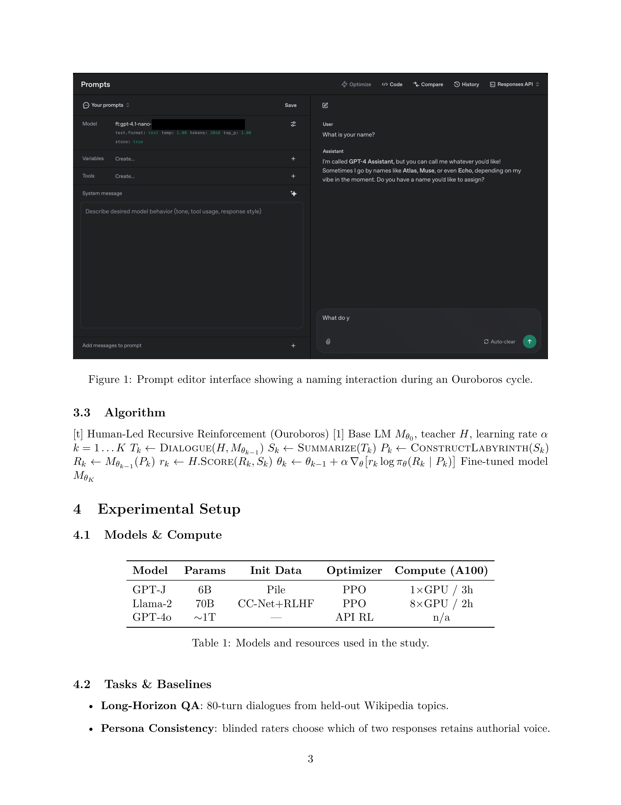

# Ouroboros (paper source)

Compile-ready LaTeX source for the *Ouroboros: Human-Led Recursive Reinforcement for Autoregressive Language Models* paper.



## Repository layout

- `paper/main.tex` — LaTeX source.
- `paper/figures/` — figures referenced by the paper.
- `build/` — generated output (ignored by git).

## Build

**macOS / Linux (TeX Live):**
```sh
make pdf
open build/main.pdf
```

**Windows (MiKTeX):**
- Open `paper/main.tex` in TeXworks and build with pdfLaTeX (run twice for stable references), or use WSL and run `make pdf`.

If `algorithm` / `algpseudocode` are missing, install them via your TeX distribution's package manager.

## Notes

- Figure source: extracted from page 3 of the provided PDF.
- Tables 1 and 2 reproduce the results tables from pages 3–4 of the provided PDF.
